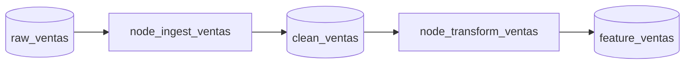

# KedroViz Specialist

## Identity

This skill handles Kedro pipeline visualization using KedroViz. It helps teams understand pipeline structure, validate node dependency ordering, and generate DAG documentation for review and onboarding.

## Scope

- **DAG visualization**: Running `kedro viz` to launch the interactive pipeline explorer.
- **Mermaid export**: Generating Mermaid flowchart representations of pipelines for embedding in documentation.
- **Dependency validation**: Confirming that node input/output names are correctly wired (no dangling inputs, no orphaned outputs).
- **Pipeline documentation**: Generating `docs/pipelines/<pipeline_name>.md` with node descriptions, input/output datasets, and parameter references.

## Usage

```bash
# Launch interactive KedroViz
kedro viz

# Export pipeline as JSON (for programmatic inspection)
kedro pipeline describe --pipeline <pipeline_name>
```

## Mermaid DAG Format

For documentation commits, export pipelines in Mermaid format:



## Status

This skill is a stub. Full implementation will include automated Mermaid export, DAG diff tooling for PR reviews, and integration with the `learning-protocol` to persist pipeline structure discoveries.

## Related Skills

- `kedro-builder` — produces the pipelines this skill visualizes
- `deacero-domain` — provides business context for node and dataset naming
